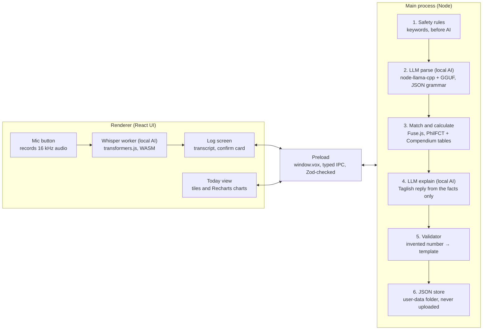

# Vox — Implementation Plan (Local AI Hackathon)

As of 2026-10-10

## Overview

Vox ships as an Electron desktop app for Windows and macOS with every AI model bundled and run inside the app: a GGUF language model loaded by node-llama-cpp in the main process, and a Whisper speech model run by transformers.js in the renderer. At runtime the app makes no network calls at all; the internet is only needed once, to install npm packages and download the model files.

**Confirmed decisions**

| Decision | Answer |
| --- | --- |
| Platform | Electron desktop app, Windows and macOS |
| Where AI runs | Bundled in the app: GGUF model from Hugging Face, loaded in-process |
| Demo laptop RAM | 8 GB, so the language model must stay around 2 GB |
| Team size | 2–3 people (from the team spec) |
| Deadline | Submission at 10:00 AM, Oct 10, no extensions; repo frozen at that time |

**Two questions are still open**, so the plan works either way instead of assuming an answer:

- **Hours left:** phases are in strict priority order, each with an estimate and an exit check. Everything above the cut line in the table below is the minimum demo; stop adding phases when you reach your last hour.
- **Teen mode or adults-only:** Phase 7 has a required part (safety checks) and an optional part (teen mode). If you skip teen mode, Phase 7 shows the 18+ gate to use instead.

**Phases at a glance**

| Phase | Goal | Owner | Estimate | Priority |
| --- | --- | --- | --- | --- |
| 0 | Scaffold, install, download models | A | 45 min | Must |
| 1 | Embedded LLM service + IPC | A | 1 hr | Must |
| 2 | Calc engine + reference data | C (or B) | 45 min, parallel | Must |
| 3 | Parse, match, confirm | A + B | 1 hr 15 min | Must |
| 4 | Explain + validator, tag `demo-safe` | A | 45 min | Must |
| 5 | Profile, Log and Today screens, charts | B | 1 hr 15 min, parallel | Must |
| — | **Cut line: minimum demo above** | | | |
| 6 | Voice input (local Whisper) | B | 1 hr | Should |
| 7A | Safety keyword checks | A | 30 min | Should |
| 7B | Teen mode (optional) | A + B | 45 min | Could |
| 8 | Offline test, README, video, submit | All | 1 hr, last hour | Must |

Owners: **A** = AI and backend, **B** = frontend, **C** = data, tests and pitch. With 2 people, A takes Phase 2's calc code and B takes the data entry.

**How to use this plan:** work top to bottom, finish each phase's exit check, commit, and create a git tag before moving on. `main` must always run. Reserve the final hour for Phase 8 no matter where you are.

---

## Hardware budget and model selection

On an 8 GB laptop the language model must be a ~3B-parameter model at 4-bit quantization (about 2 GB), and the speech model should be Whisper base (about 100–250 MB). Anything larger risks swapping to disk, which makes replies take 30+ seconds on stage.

**Approximate memory budget** (all figures are rough estimates; measure on your own laptop in Phase 1)

| Item | Approx. RAM |
| --- | --- |
| Windows or macOS + background apps | 3–3.5 GB |
| Electron app (main + renderer) | 0.4–0.6 GB |
| LLM weights, 3B at Q4_K_M | ~2 GB |
| LLM context (4096 tokens) | 0.15–0.3 GB |
| Whisper base, quantized, plus ONNX runtime | 0.2–0.4 GB |
| **Total** | **~6–6.8 GB** |

This fits only if you **close Chrome, Slack and other heavy apps** during the demo. During development, team members without the model loaded should use mock mode (see Development rules) to save RAM.

### Language model shortlist (GGUF from Hugging Face)

Test all three in Phase 1 with the same 10 Taglish sentences, then keep the fastest one that parses correctly. Verify every size and file name on the Hugging Face page before downloading.

| Role | Model | Repo / file | Approx. size | License |
| --- | --- | --- | --- | --- |
| Candidate 1 | Qwen2.5-3B-Instruct, Q4_K_M | `Qwen/Qwen2.5-3B-Instruct-GGUF` / `qwen2.5-3b-instruct-q4_k_m.gguf` | ~2.0 GB | Qwen Research License, **verify it allows hackathon use** |
| Candidate 2 | Llama-3.2-3B-Instruct, Q4_K_M | `bartowski/Llama-3.2-3B-Instruct-GGUF` / `Llama-3.2-3B-Instruct-Q4_K_M.gguf` | ~2.0 GB | Llama 3.2 Community License |
| Fallback (slow laptops) | Qwen2.5-1.5B-Instruct, Q4_K_M | `Qwen/Qwen2.5-1.5B-Instruct-GGUF` / `qwen2.5-1.5b-instruct-q4_k_m.gguf` | ~1.1 GB | Apache 2.0 |

Notes on the shortlist:

- **Newer models may be better.** Models released close to or after mid-2026 (for example newer Gemma or Qwen versions) might handle Taglish better. Only swap one in if a GGUF of **2.5 GB or less** exists, its license allows your use, and node-llama-cpp loads it without errors.
- **Avoid "thinking" models** (models that write hidden reasoning before answering) unless thinking can be switched off. Reasoning tokens make every reply several times slower on CPU.
- **Avoid gated repos** (ones that require accepting a license on Hugging Face and logging in) unless someone has already accepted it, because the download script can't log in.

### Speech-to-text model (ONNX for transformers.js)

| Role | Model | Repo | Notes |
| --- | --- | --- | --- |
| Primary | Whisper base, multilingual, 8-bit | `onnx-community/whisper-base` | Use the multilingual model, not `.en`, because Taglish mixes Filipino and English |
| If accuracy is poor | Whisper small, multilingual, 8-bit | `onnx-community/whisper-small` | Better Filipino, but roughly 3× slower on CPU; test before switching |
| If too slow | Whisper tiny, multilingual | `onnx-community/whisper-tiny` | Fast but weak on Filipino words |

### Expected speed

On CPU, a 3B Q4 model typically produces somewhere around 5–20 tokens per second depending on the laptop. Apple Silicon Macs use Metal and are much faster; Windows laptops with AMD or NVIDIA GPUs can use Vulkan or CUDA through node-llama-cpp. A parse reply is about 40–80 tokens and an explain reply about 60–100 tokens, so expect roughly 3–15 seconds per step on CPU. Record your real numbers in Phase 1 and report only measured figures, since fake benchmarks are a disqualification rule.

---

## Tech stack

Everything is TypeScript in one electron-vite project, so all three people work in the same language and repo. Install the latest stable version of each package at scaffold time and let `package-lock.json` record exact versions for the disclosure list.

| Layer | Choice | Why |
| --- | --- | --- |
| Runtime | Node.js 22 LTS | electron-vite needs Node 20.19+ or 22.12+ |
| Desktop shell | Electron | One codebase for Windows and macOS |
| Build tool | electron-vite, `react-ts` template | One config for main, preload and renderer; fast hot reload |
| UI | React + TypeScript | Team familiarity |
| Styling | Tailwind CSS v4 via `@tailwindcss/vite` | Fast to style; switch to plain CSS if setup takes over 15 minutes |
| State | Zustand | Tiny, no boilerplate |
| Charts | Recharts | Simple bar and line charts |
| Local LLM | **node-llama-cpp** (v3) loading a GGUF file | Runs llama.cpp inside the main process; ships prebuilt binaries for Windows and macOS; supports JSON-schema grammars that force valid JSON |
| Local speech-to-text | **@huggingface/transformers** (v3) running Whisper ONNX in a Web Worker | Pure WASM/WebGPU, so no native build on either OS |
| Validation | Zod | Validates LLM output, IPC payloads and stored data |
| Fuzzy matching | Fuse.js | Matches "adobong baboy" to `pork_adobo` |
| Storage | **JSON file store** in Electron's user-data folder, written atomically | Data is tiny; avoids native-module rebuild problems with better-sqlite3 |
| Tests | Vitest | Works with Vite out of the box |
| Packaging | electron-builder (already in the template) | Optional; the demo can run from `npm run dev` |

**Why node-llama-cpp instead of Ollama:** the model loads inside your app's own process, so there's no separate program for judges to install and no localhost server. That makes "the AI lives in the app" literally true, which supports the 25% Local AI score.

**Why a JSON store instead of SQLite:** node-llama-cpp is already one native dependency. Adding better-sqlite3 means a second native module that must be rebuilt for Electron on two operating systems. A JSON file holding a few hundred log entries is fast enough and has zero build risk. If you strongly prefer SQLite, it's a contained swap inside `store/`.

---

## Architecture

The renderer handles the screen and the microphone, the main process owns the language model, the math and the data, and they talk only through a small typed API in the preload script. The LLM is used twice per log, once to parse and once to explain, and plain code does every calculation in between.



The two AI steps in the main process never produce numbers: step 3 is plain code, and step 5 replaces any reply that invents one. Both models load from local files, and the page's CSP blocks every outside server.

### One log, start to finish

1. **Capture (renderer).** The user holds the mic button; audio is recorded and resampled to 16 kHz mono.
2. **Transcribe (renderer, Web Worker).** Whisper turns audio into text. The transcript is shown and editable. Typed input skips steps 1–2.
3. **Safety pre-check (main).** Crisis and medical red-flag keywords are checked on the raw text before any AI runs.
4. **Parse (main, LLM).** The LLM turns text into JSON, forced by a JSON-schema grammar, then Zod validates it.
5. **Match (main, code).** Fuse.js maps each item to the food or activity tables. Unmatched items are flagged.
6. **Confirm (renderer).** A card shows what was understood; the user fixes items or taps Confirm.
7. **Calculate (main, code).** Pure functions compute calories, minutes, intensity and day totals into a `Facts` object.
8. **Explain (main, LLM).** The LLM writes a short Taglish reaction using only the facts.
9. **Validate (main, code).** Any number in the reply that isn't in the facts, or any blocked word, swaps the reply for a template.
10. **Save and show.** The entry is written to the JSON store and the reaction appears.

### Folder structure

```
vox/
├─ README.md
├─ CLAUDE.md                     # rules for AI coding assistants (copy as AGENTS.md)
├─ package.json
├─ electron.vite.config.ts
├─ electron-builder.yml
├─ docs/
│  ├─ IMPLEMENTATION_PLAN.md     # this file
│  └─ bench.md                   # real measured speeds
├─ models/                       # git-ignored; filled by npm run models:download
│  └─ llm/<model>.gguf
├─ scripts/
│  ├─ download-models.mjs        # downloads GGUF + Whisper files from Hugging Face
│  ├─ copy-ort-wasm.mjs          # copies ONNX runtime .wasm files for offline use
│  └─ bench-models.mjs           # times candidate LLMs on 10 sentences
├─ data/
│  ├─ foods.ph.json
│  ├─ activities.json
│  ├─ combos.json
│  └─ SOURCES.md
├─ src/
│  ├─ shared/                    # imported by main AND renderer
│  │  ├─ schemas.ts              # Zod: Profile, ParsedLog, MatchedItem, Facts, LogEntry
│  │  ├─ api.ts                  # the VoxApi type exposed by preload
│  │  └─ calc/                   # bmr, tdee, exercise, food, day, rounding
│  ├─ main/
│  │  ├─ index.ts                # window, security settings, startup
│  │  ├─ ipc.ts                  # handlers, Zod-validated input
│  │  ├─ confirm.ts              # builds Facts, runs explain, saves entry
│  │  ├─ dev/seed.ts             # demo history (dev only, clearly labelled)
│  │  ├─ ai/
│  │  │  ├─ llm.ts               # node-llama-cpp load, queue, generate()
│  │  │  ├─ fakeLlm.ts           # mock mode for UI work
│  │  │  ├─ parse.ts
│  │  │  ├─ parse.schema.json
│  │  │  ├─ explain.ts
│  │  │  ├─ validator.ts
│  │  │  ├─ templates.ts
│  │  │  └─ prompts/             # parse.md, explain.adult.md, explain.teen.md
│  │  ├─ matching/match.ts
│  │  ├─ safety/                 # rules.ts, responses.ts
│  │  └─ store/store.ts          # JSON file store
│  ├─ preload/index.ts
│  └─ renderer/
│     ├─ index.html
│     ├─ public/                 # served as / in dev
│     │  ├─ models/              # git-ignored Whisper files
│     │  └─ ort/                 # git-ignored ONNX runtime wasm
│     └─ src/
│        ├─ App.tsx
│        ├─ env.d.ts
│        ├─ screens/             # Setup, Profile, Log, Today
│        ├─ components/          # MicButton, ConfirmCard, ReactionBubble, StatTile
│        ├─ voice/               # recorder.ts, stt.worker.ts
│        └─ store.ts             # Zustand
└─ tests/                        # calc, data, validator, safety, parse.golden
```

---

## Phase 0: Setup and installation (45 min, owner A)

The goal is an empty Electron app running on every team laptop with all packages installed and all model files downloaded, before anyone writes features. Do the model download first, because 2+ GB takes a while on venue or home internet.

### 0.1 Prerequisites on every laptop

- **Node.js 22 LTS** and **git**. Check with `node -v` (must be 20.19+ or 22.12+).
- **macOS:** Xcode Command Line Tools, `xcode-select --install`.
- **Windows:** nothing extra if node-llama-cpp's prebuilt binary loads. If it falls back to building from source, it needs CMake and Visual Studio Build Tools; treat that as a blocker and switch that laptop to mock mode rather than losing an hour.

### 0.2 Scaffold and install

```bash
npm create @quick-start/electron@latest vox -- --template react-ts
cd vox
npm install

# runtime dependencies
npm install node-llama-cpp @huggingface/transformers zod fuse.js recharts zustand

# dev dependencies
npm install -D vitest tailwindcss @tailwindcss/vite

# check that llama.cpp loads and which GPU it sees
npx --no node-llama-cpp inspect gpu
```

Add to `.gitignore`:

```
models/
src/renderer/public/models/
src/renderer/public/ort/
```

Model files are never committed: GitHub rejects files over 100 MB, and judges download them with one script.

### 0.3 Model download script

`scripts/download-models.mjs` fetches files directly from Hugging Face's public download URLs, so it needs no Python and no login. It skips files that already exist.

```js
// scripts/download-models.mjs
import { createWriteStream, existsSync, mkdirSync, renameSync, statSync } from 'node:fs';
import { dirname, join } from 'node:path';
import { Readable } from 'node:stream';
import { pipeline } from 'node:stream/promises';

// VERIFY each repo + file name on huggingface.co before running
const LLMS = {
  qwen3b:  { repo: 'Qwen/Qwen2.5-3B-Instruct-GGUF',        file: 'qwen2.5-3b-instruct-q4_k_m.gguf' },
  llama3b: { repo: 'bartowski/Llama-3.2-3B-Instruct-GGUF', file: 'Llama-3.2-3B-Instruct-Q4_K_M.gguf' },
  qwen15b: { repo: 'Qwen/Qwen2.5-1.5B-Instruct-GGUF',      file: 'qwen2.5-1.5b-instruct-q4_k_m.gguf' },
};
const WHISPER = {
  repo: 'onnx-community/whisper-base',
  files: [
    'config.json', 'generation_config.json', 'preprocessor_config.json',
    'tokenizer.json', 'tokenizer_config.json',
    'onnx/encoder_model_quantized.onnx', 'onnx/decoder_model_merged_quantized.onnx',
  ],
};

async function get(repo, file, dest) {
  if (existsSync(dest) && statSync(dest).size > 0) return console.log('skip', dest);
  mkdirSync(dirname(dest), { recursive: true });
  const url = `https://huggingface.co/${repo}/resolve/main/${file}`;
  console.log('get ', url);
  const res = await fetch(url);
  if (!res.ok) throw new Error(`${res.status} ${url}`);
  await pipeline(Readable.fromWeb(res.body), createWriteStream(dest + '.part'));
  renameSync(dest + '.part', dest);
}

const wanted = process.argv.slice(2).length ? process.argv.slice(2) : ['qwen3b'];
for (const key of wanted) {
  const m = LLMS[key];
  if (!m) throw new Error(`unknown model key ${key}`);
  await get(m.repo, m.file, join('models', 'llm', m.file));
}
for (const f of WHISPER.files) {
  await get(WHISPER.repo, f, join('src/renderer/public/models', WHISPER.repo, f));
}
console.log('done');
```

Run it once per laptop: `npm run models:download -- qwen3b llama3b qwen15b` for the Phase 1 comparison, then only the winner afterwards.

### 0.4 Offline ONNX runtime files

By default transformers.js downloads its WebAssembly runtime from a CDN, which breaks the app offline. This script copies those files into the app so they're served locally.

```js
// scripts/copy-ort-wasm.mjs
import { cpSync, mkdirSync, readdirSync } from 'node:fs';
const src = 'node_modules/onnxruntime-web/dist';   // VERIFY path after npm install
const dest = 'src/renderer/public/ort';
mkdirSync(dest, { recursive: true });
for (const f of readdirSync(src)) {
  if (/^ort-wasm.*\.(wasm|mjs)$/.test(f)) cpSync(`${src}/${f}`, `${dest}/${f}`);
}
console.log('copied ort wasm files');
```

### 0.5 package.json scripts

```json
{
  "scripts": {
    "models:download": "node scripts/download-models.mjs",
    "ort:copy": "node scripts/copy-ort-wasm.mjs",
    "bench": "node scripts/bench-models.mjs",
    "dev:mock": "VOX_FAKE_LLM=1 electron-vite dev",
    "test": "vitest run"
  }
}
```

Keep the template's existing scripts (`dev`, `build`, `postinstall`, and so on) and add these beside them. Append `&& npm run ort:copy` to the existing `postinstall` so the runtime files are always present. (`dev:mock` works on macOS; on Windows use the PowerShell form shown in Phase 1.2.)

### 0.6 electron-vite config additions

Keep the generated `electron.vite.config.ts` and add the marked parts:

```ts
import { resolve } from 'path';
import tailwindcss from '@tailwindcss/vite';             // ADD

// inside defineConfig({...}):
//   main.resolve.alias     -> { '@shared': resolve('src/shared') }   ADD
//   preload.resolve.alias  -> { '@shared': resolve('src/shared') }   ADD
//   renderer.resolve.alias -> add '@shared': resolve('src/shared')   ADD
//   renderer.plugins       -> [react(), tailwindcss()]               ADD tailwindcss()
//   renderer.worker        -> { format: 'es' }                       ADD (Whisper worker)
```

The main process must not bundle node-llama-cpp (it contains native binaries). The template's dependency externalization already handles this; do not move node-llama-cpp to devDependencies.

### Exit check

- [ ] `npm run dev` opens the window on every laptop
- [ ] `models/llm/` holds at least one `.gguf`; `src/renderer/public/models/` holds the Whisper files
- [ ] `src/renderer/public/ort/` holds `ort-wasm*.wasm` files
- [ ] `npx --no node-llama-cpp inspect gpu` runs without errors
- [ ] Commit and `git tag phase-0`

---

## Phase 1: Embedded LLM service (1 hr, owner A)

The goal is a `generate()` function in the main process that runs the bundled GGUF model, forces JSON output when asked, runs one request at a time, and reports its status to the UI. Code below targets the node-llama-cpp v3 API; check each call against its docs (node-llama-cpp.withcat.ai) and the installed type definitions, since minor names can change between versions.

### 1.1 LLM service (`src/main/ai/llm.ts`)

```ts
import path from 'node:path';
import { app } from 'electron';
import type { Llama, LlamaModel, LlamaContext } from 'node-llama-cpp';

export type AiStatus = { state: 'loading' | 'ready' | 'error'; message?: string };

let nlc: typeof import('node-llama-cpp');
let llama: Llama;
let model: LlamaModel;
let context: LlamaContext;
let queue: Promise<unknown> = Promise.resolve();

const MODEL_FILE = process.env.VOX_MODEL_FILE ?? 'qwen2.5-3b-instruct-q4_k_m.gguf';

function modelPath() {
  const base = app.isPackaged
    ? path.join(process.resourcesPath, 'models')
    : path.join(app.getAppPath(), 'models');
  return path.join(base, 'llm', MODEL_FILE);
}

export async function initLlm(onStatus: (s: AiStatus) => void) {
  try {
    onStatus({ state: 'loading', message: 'Loading AI model on this computer…' });
    nlc = await import('node-llama-cpp');            // ESM-only package: dynamic import
    llama = await nlc.getLlama();                     // picks Metal / Vulkan / CUDA / CPU
    model = await llama.loadModel({ modelPath: modelPath() });
    context = await model.createContext({ contextSize: 4096 });
    await generate({ system: 'Reply with OK.', user: 'Hi', temperature: 0, maxTokens: 4, timeoutMs: 60_000 });
    onStatus({ state: 'ready' });
  } catch (err) {
    onStatus({ state: 'error', message: String(err) });
  }
}

// one request at a time: a single context sequence, small RAM
function serialize<T>(fn: () => Promise<T>): Promise<T> {
  const run = queue.then(fn, fn);
  queue = run.catch(() => undefined);
  return run;
}

export type GenerateOpts = {
  system: string;
  user: string;
  jsonSchema?: object;      // when set, output is forced to match it
  temperature: number;
  maxTokens: number;
  timeoutMs: number;
};

export function generate(opts: GenerateOpts): Promise<string> {
  return serialize(async () => {
    const session = new nlc.LlamaChatSession({
      contextSequence: context.getSequence(),
      systemPrompt: opts.system,
    });
    const grammar = opts.jsonSchema
      ? await llama.createGrammarForJsonSchema(opts.jsonSchema as never)
      : undefined;
    const abort = new AbortController();
    const timer = setTimeout(() => abort.abort(), opts.timeoutMs);
    try {
      return await session.prompt(opts.user, {
        grammar,
        temperature: opts.temperature,
        maxTokens: opts.maxTokens,
        signal: abort.signal,
      });
    } finally {
      clearTimeout(timer);
      // disposeSequence defaults to false in node-llama-cpp 3.22.1. A plain dispose() keeps
      // the context's only sequence taken, so the NEXT request throws. Verified 2026-10-10.
      session.dispose({ disposeSequence: true });
    }
  });
}
```

Key points:

- **A fresh session per request** means no chat history leaks between logs, and the prompt stays short.
- **The JSON-schema grammar** makes the model physically unable to output invalid JSON. node-llama-cpp supports a subset of JSON Schema, so the parse schema in Phase 3 is deliberately flat (no `oneOf` or `anyOf`).
- **Load in the background.** The window opens immediately and shows a loading state; never block `app.whenReady` on the model.

### 1.2 Mock mode (`src/main/ai/fakeLlm.ts`)

When `VOX_FAKE_LLM=1`, `generate()` returns canned replies instead of loading the model. The frontend developer uses this so their 8 GB laptop isn't running a 2 GB model while they build screens.

```ts
export async function fakeGenerate(opts: { jsonSchema?: object }): Promise<string> {
  await new Promise((r) => setTimeout(r, 400));
  if (opts.jsonSchema) {
    return JSON.stringify({
      foods: [{ name: 'kanin', quantity: 2, unit: 'cup' }, { name: 'adobong manok', quantity: 1, unit: 'serving' }],
      exercises: [{ activity: 'jogging', durationMin: 30, effort: 'moderate' }],
      sleepHours: 0, waterGlasses: 0, bodyWeightKg: 0, unclear: [],
    });
  }
  return 'Ayos! Solid yung jog mo today. Inom ka ng tubig tapos pahinga nang maayos mamaya.';
}
```

Run it with `VOX_FAKE_LLM=1 npm run dev` on macOS, or `$env:VOX_FAKE_LLM=1; npm run dev` in Windows PowerShell.

### 1.3 Window security (`src/main/index.ts`)

```ts
const win = new BrowserWindow({
  width: 1200, height: 800, show: false,
  webPreferences: {
    preload: join(__dirname, '../preload/index.js'),
    contextIsolation: true,
    nodeIntegration: false,
    sandbox: true,
  },
});
win.webContents.setWindowOpenHandler(({ url }) => { shell.openExternal(url); return { action: 'deny' }; });
session.defaultSession.setPermissionRequestHandler((_wc, permission, cb) => cb(permission === 'media'));

if (process.platform === 'darwin') systemPreferences.askForMediaAccess('microphone');

const send = (s: AiStatus) => win.webContents.send('ai:status-changed', s);
if (process.env.VOX_FAKE_LLM !== '1') initLlm(send); else send({ state: 'ready', message: 'mock mode' });
```

The template's preload imports `@electron-toolkit/preload`. With `sandbox: true` a preload can't load npm packages at runtime, so **remove that import** and use only `contextBridge` and `ipcRenderer` from `electron`.

### 1.4 Typed API between renderer and main

```ts
// src/shared/api.ts
import type { Profile, ProfileInput, ParseResult, ConfirmInput, ConfirmResult, DaySummary } from './schemas';
import type { AiStatus } from './status';

export interface VoxApi {
  ai: { status(): Promise<AiStatus>; onStatus(cb: (s: AiStatus) => void): () => void };
  profile: { get(): Promise<Profile | null>; save(p: ProfileInput): Promise<Profile> };
  log: { parse(text: string): Promise<ParseResult>; confirm(input: ConfirmInput): Promise<ConfirmResult> };
  day: { get(date: string): Promise<DaySummary> };
  history: { range(from: string, to: string): Promise<DaySummary[]> };
}
```

```ts
// src/preload/index.ts
import { contextBridge, ipcRenderer } from 'electron';
import type { VoxApi } from '../shared/api';

const api: VoxApi = {
  ai: {
    status: () => ipcRenderer.invoke('ai:status'),
    onStatus: (cb) => {
      const h = (_e: unknown, s: never) => cb(s);
      ipcRenderer.on('ai:status-changed', h);
      return () => ipcRenderer.removeListener('ai:status-changed', h);
    },
  },
  profile: { get: () => ipcRenderer.invoke('profile:get'), save: (p) => ipcRenderer.invoke('profile:save', p) },
  log: { parse: (t) => ipcRenderer.invoke('log:parse', t), confirm: (i) => ipcRenderer.invoke('log:confirm', i) },
  day: { get: (d) => ipcRenderer.invoke('day:get', d) },
  history: { range: (f, t) => ipcRenderer.invoke('history:range', f, t) },
};
contextBridge.exposeInMainWorld('vox', api);
```

```ts
// src/main/ipc.ts: every handler validates its input
function handle<S extends z.ZodTypeAny>(channel: string, schema: S, fn: (input: z.infer<S>) => unknown) {
  ipcMain.handle(channel, async (_e, raw) => fn(schema.parse(raw)));
}
handle('log:parse', z.string().min(1).max(500), (text) => parseLog(text));
```

In the renderer, declare `window.vox` once in `src/renderer/src/env.d.ts`: `declare global { interface Window { vox: VoxApi } }`.

### 1.5 Model comparison (`scripts/bench-models.mjs`)

A plain Node script that loads each downloaded GGUF, runs the parse prompt on the same 10 Taglish sentences with the parse JSON schema, and prints seconds per sentence plus the JSON. Write the parse schema as `src/main/ai/parse.schema.json` (Phase 3) so this script and the app share it. Record the results in `docs/bench.md` with the laptop model and RAM; these are your real benchmark numbers for the pitch.

### Exit check

- [ ] Status goes loading → ready in the UI (a plain text line is enough for now)
- [ ] A temporary debug button sends a sentence and logs the raw model output
- [ ] Model chosen; its file name set in `VOX_MODEL_FILE` default
- [ ] Mock mode works without any model file
- [ ] Commit and `git tag phase-1`

---

## Phase 2: Calculation engine and reference data (45 min, parallel, owner C)

The goal is pure, tested functions for every number the app shows, plus about 12 foods and 6 activities copied from cited sources. This phase needs no AI and no UI, so it runs in parallel with Phase 1.

### 2.1 Calc functions (`src/shared/calc/`)

```ts
// rounding.ts
export const round10 = (n: number) => Math.round(n / 10) * 10;      // kcal shown to nearest 10
export const roundHalf = (n: number) => Math.round(n * 2) / 2;      // hours, glasses

// age.ts
export function ageYears(birthDate: string, today = new Date()): number {
  const b = new Date(birthDate);
  let a = today.getFullYear() - b.getFullYear();
  const m = today.getMonth() - b.getMonth();
  if (m < 0 || (m === 0 && today.getDate() < b.getDate())) a--;
  return a;
}

// bmr.ts: Mifflin–St Jeor (1990)
export function bmr(sex: 'male' | 'female', kg: number, cm: number, age: number): number {
  return 10 * kg + 6.25 * cm - 5 * age + (sex === 'male' ? 5 : -161);
}

// tdee.ts
export const ACTIVITY_FACTORS = {
  sedentary: 1.2, light: 1.375, moderate: 1.55, active: 1.725, very_active: 1.9,
} as const;
export const tdee = (bmrValue: number, level: keyof typeof ACTIVITY_FACTORS) =>
  bmrValue * ACTIVITY_FACTORS[level];

// exercise.ts: kcal ≈ MET × kg × hours
export const exerciseKcal = (met: number, kg: number, minutes: number) => met * kg * (minutes / 60);
export function intensity(met: number): 'light' | 'moderate' | 'vigorous' {
  if (met < 3) return 'light';
  if (met < 6) return 'moderate';
  return 'vigorous';
}

// food.ts
export const foodKcal = (grams: number, kcalPer100g: number) => (grams / 100) * kcalPer100g;
```

The intensity bands follow the common convention: light under 3 METs, moderate 3 to under 6, vigorous 6 and above. This slightly corrects the team spec, which said "over 6" for vigorous.

### 2.2 Unit tests (`tests/calc.test.ts`)

These use **made-up inputs** to check the arithmetic only. They are not nutrition facts.

```ts
import { describe, it, expect } from 'vitest';
import { bmr, tdee, exerciseKcal, foodKcal, intensity, round10 } from '../src/shared/calc';

describe('calc (synthetic inputs, arithmetic only)', () => {
  it('bmr male 70 kg, 170 cm, 25 y', () => expect(bmr('male', 70, 170, 25)).toBe(1642.5));
  it('bmr female 70 kg, 170 cm, 25 y', () => expect(bmr('female', 70, 170, 25)).toBe(1476.5));
  it('tdee moderate', () => expect(round10(tdee(1642.5, 'moderate'))).toBe(2550));
  it('exercise MET 8, 70 kg, 30 min', () => expect(exerciseKcal(8, 70, 30)).toBe(280));
  it('food 150 g at 130 kcal/100 g', () => expect(foodKcal(150, 130)).toBe(195));
  it('intensity bands', () => {
    expect(intensity(2.9)).toBe('light');
    expect(intensity(3)).toBe('moderate');
    expect(intensity(6)).toBe('vigorous');
  });
});
```

### 2.3 Reference data format

```jsonc
// data/foods.ph.json (one row shown; values intentionally left out)
{
  "id": "rice_white_cooked",
  "name": "White rice, cooked",
  "aliases": ["kanin", "white rice", "rice", "puting kanin"],
  "kcalPer100g": 0,
  "portions": { "cup": 0 },
  "defaultUnit": "cup",
  "foodGroup": "grains",
  "source": "PhilFCT, <entry name/code>, accessed 2026-10-10",
  "portionSource": "<where the grams per cup came from>"
}
```

```jsonc
// data/activities.json (one row shown; values intentionally left out)
{
  "id": "jogging_general",
  "name": "Jogging, general",
  "aliases": ["jog", "jogging", "nag-jog"],
  "compendiumCode": "<code>",
  "met": 0,
  "source": "2024 Adult Compendium, pacompendium.com, accessed 2026-10-10"
}
```

Data rules for whoever fills these files:

- **Copy every number from the source**, never from memory or from an AI. Record the entry name or code in `source`.
- **Only complete rows go in the file.** Keep half-finished rows in `data/foods.draft.json`, which the app doesn't load.
- **Pick foods from the demo script first** (for example rice, tapsilog parts, adobo, milk tea, Coke, pandesal, egg, banana), then add extras if time allows. Packaged items use the product label as the source.
- **Aliases matter more than count.** Add English, Filipino and common Taglish spellings, because matching depends on them.

### 2.4 Data test (`tests/data.test.ts`)

Fail the build if any row is missing a field, has a zero or negative value, or has an empty `source`. This makes it impossible to ship an unsourced number by accident.

```ts
import foods from '../data/foods.ph.json';
import activities from '../data/activities.json';

it('every food row is complete and sourced', () => {
  for (const f of foods) {
    expect(f.source.trim().length, f.id).toBeGreaterThan(10);
    expect(f.kcalPer100g, f.id).toBeGreaterThanOrEqual(0);
    expect(Object.values(f.portions).every((g) => g > 0), f.id).toBe(true);
    expect(f.aliases.length, f.id).toBeGreaterThan(0);
  }
});
it('every activity row is complete and sourced', () => {
  for (const a of activities) {
    expect(a.met, a.id).toBeGreaterThan(0);
    expect(a.compendiumCode, a.id).not.toMatch(/</);
    expect(a.source.trim().length, a.id).toBeGreaterThan(10);
  }
});
```

Water, zero-calorie drinks and similar items are the only rows allowed a `kcalPer100g` of 0.

### Exit check

- [ ] `npm test` passes calc and data tests
- [ ] At least 12 foods and 6 activities, all sourced, covering every item in the demo script
- [ ] `data/SOURCES.md` lists each source with its access date
- [ ] Commit and `git tag phase-2`

---

## Phase 3: Parse, match and confirm (1 hr 15 min, owners A + B)

The goal is the core loop: a typed Taglish sentence becomes a confirmation card of matched items that the user can fix and confirm. A builds parse and match in main; B builds the card against mock mode at the same time.

### 3.1 Parse schema (`src/main/ai/parse.schema.json`)

The schema is flat on purpose: separate arrays for foods and exercises, and plain numbers where 0 means "not mentioned". node-llama-cpp's grammar supports this subset reliably, and small models fill it more consistently.

```json
{
  "type": "object",
  "properties": {
    "foods": { "type": "array", "items": { "type": "object", "properties": {
      "name": { "type": "string" },
      "quantity": { "type": "number" },
      "unit": { "type": "string" }
    }, "required": ["name", "quantity", "unit"] } },
    "exercises": { "type": "array", "items": { "type": "object", "properties": {
      "activity": { "type": "string" },
      "durationMin": { "type": "number" },
      "effort": { "type": "string", "enum": ["light", "moderate", "hard", "unknown"] }
    }, "required": ["activity", "durationMin", "effort"] } },
    "sleepHours": { "type": "number" },
    "waterGlasses": { "type": "number" },
    "bodyWeightKg": { "type": "number" },
    "unclear": { "type": "array", "items": { "type": "string" } }
  },
  "required": ["foods", "exercises", "sleepHours", "waterGlasses", "bodyWeightKg", "unclear"]
}
```

There is deliberately **no calorie field** anywhere in this schema, so the model has no place to put one.

### 3.2 Zod mirror with sanity limits (`src/shared/schemas.ts`)

```ts
export const ParsedLog = z.object({
  foods: z.array(z.object({
    name: z.string().min(1).max(60),
    quantity: z.number().positive().max(20),
    unit: z.string().max(20),
  })).max(15),
  exercises: z.array(z.object({
    activity: z.string().min(1).max(60),
    durationMin: z.number().positive().max(600),
    effort: z.enum(['light', 'moderate', 'hard', 'unknown']),
  })).max(10),
  sleepHours: z.number().min(0).max(24),
  waterGlasses: z.number().min(0).max(30),
  bodyWeightKg: z.number().min(0).max(300),
  unclear: z.array(z.string()),
});
export type ParsedLog = z.infer<typeof ParsedLog>;
```

### 3.3 Parse with one retry (`src/main/ai/parse.ts`)

```ts
export async function parseLog(text: string): Promise<ParseResult> {
  let lastError = '';
  for (let attempt = 0; attempt < 2; attempt++) {
    const user = attempt === 0
      ? text
      : `${text}\n\n(Your previous output was invalid: ${lastError}. Follow the schema exactly.)`;
    try {
      const raw = await llm.generate({
        system: PARSE_PROMPT, user, jsonSchema: parseSchema,
        temperature: 0, maxTokens: 300, timeoutMs: 25_000,
      });
      const result = ParsedLog.safeParse(JSON.parse(raw));
      if (result.success) return { ok: true, parsed: result.data, items: matchAll(result.data) };
      lastError = result.error.issues[0]?.message ?? 'invalid';
    } catch (err) {
      lastError = String(err);
    }
  }
  return { ok: false, reason: 'Hindi ko masyadong na-gets. Pwede mo bang ulitin nang mas simple?' };
}
```

### 3.4 Unit normalization

The model keeps units as the user said them; code maps them to the portion keys in the food table.

| User says | Canonical unit |
| --- | --- |
| cup, cups, tasa | `cup` |
| piece, pc, pcs, piraso, isa | `piece` |
| glass, baso | `glass` |
| bowl, mangkok | `bowl` |
| plate, plato | `plate` |
| can, lata | `can` |
| serving, order, (missing) | `serving` |

If a food has no portion for that unit, use the food's `defaultUnit` and set `unitAssumed: true` so the card shows "assumed 1 serving, tap to change".

### 3.5 Matching (`src/main/matching/match.ts`)

```ts
import Fuse from 'fuse.js';

const norm = (s: string) => s.toLowerCase().normalize('NFKD').replace(/[^a-z0-9 ]/g, '').trim();
const aliasMap = new Map(foods.flatMap((f) => [f.name, ...f.aliases].map((a) => [norm(a), f])));
const fuse = new Fuse(foods, { keys: ['aliases', 'name'], threshold: 0.35, ignoreLocation: true, includeScore: true });

export function matchFood(name: string) {
  const exact = aliasMap.get(norm(name));
  if (exact) return { matched: true, ref: exact, candidates: [] };
  const hits = fuse.search(name, { limit: 3 });
  if (hits[0] && (hits[0].score ?? 1) < 0.35) return { matched: true, ref: hits[0].item, candidates: hits.slice(1).map((h) => h.item) };
  return { matched: false, ref: null, candidates: hits.map((h) => h.item) };
}
```

Activities use the same pattern with their own index. Add `data/combos.json` for Filipino combo meals so one word expands into parts, for example `"tapsilog": ["tapa_beef", "rice_garlic", "egg_fried"]`. Each part then uses its own sourced row and default portion.

**Water is not a food.** Before matching, any food whose normalized name is `tubig` or `water` is removed from `foods`. If `waterGlasses` is 0, its quantity becomes `waterGlasses`; otherwise the parser's `waterGlasses` value is kept and the food is just dropped. (Benchmark finding: Qwen2.5-3B and 1.5B both returned "uminom ako ng limang baso ng tubig" as a food *and* as `waterGlasses`.)

**Unknown items are never guessed.** An unmatched item appears on the card with its top 3 candidates and a Skip option; it is never sent to the LLM for a calorie estimate.

### 3.6 Confirmation card (renderer, owner B)

- One row per item: matched name, quantity stepper, unit dropdown (from the food's portion keys), and a remove button.
- Unmatched rows are highlighted with "Did you mean…" buttons for the candidates, plus Skip.
- Sleep, water and weight show as small chips when non-zero.
- One primary **Confirm** button sends `window.vox.log.confirm({ rawText, items })`.
- While parsing, show the transcript and a "Thinking on this computer…" indicator.

### 3.7 JSON store (`src/main/store/store.ts`)

```ts
type Db = { version: 1; profile: Profile | null; entries: LogEntry[] };
const file = () => join(app.getPath('userData'), 'vox-data.json');

export function load(): Db {
  try { return JSON.parse(readFileSync(file(), 'utf8')); }
  catch { return { version: 1, profile: null, entries: [] }; }
}
export function save(db: Db) {
  const tmp = file() + '.tmp';
  writeFileSync(tmp, JSON.stringify(db, null, 2));
  renameSync(tmp, file());               // atomic: never leaves a half-written file
}
```

Keep the database in memory and call `save()` after each confirm. Group entries by local date when building day summaries.

### Exit check

- [ ] Five test sentences produce correct cards, including one with an unknown food and one combo meal
- [ ] `tests/match.test.ts` covers the water rule: `{foods:[{name:'tubig',quantity:5,unit:'baso'}], waterGlasses:0}` → no foods, `waterGlasses: 5`; and `{foods:[{name:'Water',quantity:2,unit:'glass'}], waterGlasses:3}` → no foods, `waterGlasses: 3`
- [ ] Editing quantity and swapping a match work
- [ ] Confirm saves an entry; restarting the app keeps it
- [ ] Commit and `git tag phase-3`

---

## Phase 4: Explain, validator and templates (45 min, owner A)

The goal is a friendly Taglish reaction after each confirm that can only mention numbers the code computed. When this phase passes its exit check, the typed end-to-end flow works: tag it `demo-safe` and never demo from anything older.

### 4.1 Build the facts (`src/main/confirm.ts`)

On `log:confirm`, main computes everything with the Phase 2 functions and **rounds before the LLM sees anything**: kcal to the nearest 10, minutes to whole numbers, hours to the nearest 0.5. Rounding first means the model can't create a mismatch by rounding differently. When calories are disabled for the profile, the facts object simply has no `kcal` fields.

```ts
const facts: Facts = {
  caloriesEnabled: profile.caloriesEnabled,
  items: [
    { displayName: 'Jogging', minutes: 30, intensity: 'vigorous', kcal: 280, source: '2024 Adult Compendium' },
    { displayName: 'Kanin', quantityLabel: '2 cups', kcal: 0 /* computed from table */, source: 'PhilFCT' },
  ],
  dayTotals: { kcalIn: 0, kcalOut: 0, tdee: 0, activeMinutes: 30, waterGlasses: 0 },
};
```

The numbers above are placeholders to show the shape; real values come from your tables.

### 4.2 Explain call (`src/main/ai/explain.ts`)

```ts
export async function explain(facts: Facts, mode: 'adult' | 'teen'): Promise<Reaction> {
  const system = mode === 'teen' ? EXPLAIN_TEEN_PROMPT : EXPLAIN_ADULT_PROMPT;
  const user = `FACTS:\n${JSON.stringify(facts)}\n\nWrite the reaction now.`;
  try {
    const text = (await llm.generate({ system, user, temperature: 0.6, maxTokens: 160, timeoutMs: 25_000 })).trim();
    const check = validateReaction(text, facts, mode);
    if (check.ok) return { text, source: 'ai' };
    console.warn('reaction rejected:', check.reason, text);
    return { text: templateReaction(facts), source: 'template', rejectedReason: check.reason };
  } catch {
    return { text: templateReaction(facts), source: 'template', rejectedReason: 'timeout or error' };
  }
}
```

Temperature 0.6 is a starting point. If replies drift into English-only or get odd, lower it to 0.4; if they sound robotic, try 0.8.

### 4.3 Digit validator (`src/main/ai/validator.ts`)

The validator checks **digits only**. The prompts tell the model to write every number as digits, so number words aren't checked; checking Filipino number words would cause constant false rejections, because "isang" also means "a".

```ts
const canon = (s: string | number) => String(Number(String(s).replace(/,/g, '')));

function collectNumbers(value: unknown, out: string[] = []): string[] {
  if (typeof value === 'number') out.push(canon(value));
  else if (typeof value === 'string') for (const m of value.matchAll(/\d+(?:\.\d+)?/g)) out.push(canon(m[0]));
  else if (value && typeof value === 'object') for (const v of Object.values(value)) collectNumbers(v, out);
  return out;
}

const BLOCKED = ['bad food', 'cheat', 'failed', 'sobra ka', 'i-burn', 'burn it off', 'punish',
  'taba mo', 'mataba', 'payat ka', 'diet ka'];
const TEEN_BLOCKED = ['calorie', 'kcal', 'timbang', 'weight', 'diet', 'magpayat', 'pumayat'];

export function validateReaction(text: string, facts: Facts, mode: 'adult' | 'teen') {
  if (!text || text.length > 450) return { ok: false, reason: 'length' } as const;
  const allowed = new Set(collectNumbers(facts));
  for (const m of text.matchAll(/\d+(?:[.,]\d+)*/g)) {
    if (!allowed.has(canon(m[0]))) return { ok: false, reason: `invented number ${m[0]}` } as const;
  }
  const lower = text.toLowerCase();
  const words = mode === 'teen' ? [...BLOCKED, ...TEEN_BLOCKED] : BLOCKED;
  const hit = words.find((w) => lower.includes(w));
  if (hit) return { ok: false, reason: `blocked word ${hit}` } as const;
  return { ok: true } as const;
}
```

### 4.4 Fallback templates (`src/main/ai/templates.ts`)

Templates are filled only from facts, so they always pass the validator.

```ts
export function templateReaction(f: Facts): string {
  const ex = f.items.find((i) => i.minutes);
  if (ex) return `Nice, ${ex.minutes} minutes ng ${ex.displayName}! Tuloy lang, at uminom ka ng tubig.`;
  if (f.items.some((i) => i.quantityLabel)) return 'Noted ang kinain mo. Salamat sa pag-log, makakatulong ito para makita mo ang pattern mo.';
  return 'Na-log na. Salamat sa pag-update!';
}
```

### 4.5 Validator tests (`tests/validator.test.ts`)

- A reply using only fact numbers passes.
- A reply with an extra number (for example "500" when facts have none) fails with `invented number`.
- "2,550" in text matches 2550 in facts.
- Each blocked word fails; teen-only words fail only in teen mode.

Store `reactionSource` and `rejectedReason` on every entry. For the pitch, a small debug panel showing a real rejected reply ("AI wrote 500, not in the facts, template used") is strong evidence that the numbers are trustworthy.

### Exit check

- [ ] Typed sentence → card → confirm → reaction works end to end
- [ ] Validator tests pass
- [ ] Kill the model mid-request (or set a 1 ms timeout): the template still appears
- [ ] Commit and `git tag demo-safe`

---

## Phase 5: Screens, profile and charts (1 hr 15 min, parallel, owner B)

The goal is four screens that make the demo look finished: Setup, Profile, Log and Today. B builds all of them in mock mode from Phase 1 onward, so this runs in parallel with Phases 3 and 4.

### 5.1 Screens

| Screen | Shows | Notes |
| --- | --- | --- |
| Setup | Model loading state, or a clear error | "Loading AI on this computer…"; on error: "Model file missing. Run `npm run models:download`." Never fail silently |
| Profile | One form: nickname, birth date, sex for formulas, height, weight, activity level, goal | Replaces the spec's 10-screen onboarding. Include the line "Lahat ng data mo, nasa computer mo lang." and the not-medical-advice disclaimer |
| Log | Mic button, text box, transcript, confirmation card, reaction bubble | The main screen and the demo's centrepiece |
| Today | Stat tiles + two charts + latest reaction | Read-only |

Navigation can be a simple two-tab bar (Log, Today) with a profile icon. No router library is needed; a `screen` value in Zustand is enough.

### 5.2 Today view

- **Stat tiles (adult mode):** ~kcal in, ~kcal out, active minutes, water glasses, sleep hours. Every energy number shows "~" and the word "estimate".
- **Chart 1:** active minutes per day for the last 7 days, a Recharts `BarChart`.
- **Chart 2 (adults only):** bodyweight over the last 14–30 days, a `LineChart` with raw points plus a 7-day moving average line, computed in `src/shared/calc/`.
- **Badge:** "AI running on this computer" with a small chip icon, visible on every screen. It quietly reinforces the Local AI story.
- **Colours:** neutral only. No red "over budget" states anywhere.

```tsx
<ResponsiveContainer width="100%" height={220}>
  <BarChart data={last7Days}>
    <XAxis dataKey="label" />
    <YAxis allowDecimals={false} />
    <Tooltip />
    <Bar dataKey="activeMinutes" radius={[6, 6, 0, 0]} />
  </BarChart>
</ResponsiveContainer>
```

### 5.3 Demo history

Charts with one day of data look empty. `src/main/dev/seed.ts` (run from a hidden dev button through a `dev:seed` IPC handler, so it reuses the TypeScript calc code) writes 2–3 weeks of plausible entries into the JSON store for a **separate demo profile**. Rules:

- Every seeded entry has `seeded: true`, and the Today view shows a small "includes demo data" label when any are present.
- Seeded entries are built with the same calc functions and tables as real ones, never hand-typed numbers.
- In the pitch, say plainly that the history is demo data. The hackathon disqualifies fake benchmarks, so honesty here protects you.

### 5.4 Design notes

- Large text input and a mic button you can hit without aiming; the Log screen should feel like a chat.
- Show the transcript the instant it arrives, then a "Thinking on this computer…" state, so a 5–10 second wait feels intentional.
- Use one accent colour and plenty of whitespace. Run a quick critique pass at the end if you have a design skill installed, but don't spend setup time on tooling tonight.

### Exit check

- [ ] Profile saves and survives restart
- [ ] Today shows tiles and both charts with seeded data
- [ ] Setup screen appears when the model file is renamed away
- [ ] Commit and `git tag phase-5`

---

## Phase 6: Voice input with local Whisper (1 hr, owner B)

The goal is push-to-talk that turns speech into an editable transcript entirely on the laptop, feeding the same parse flow as typed text. Typed input stays as the fallback, so if this phase runs out of time the demo still works.

### 6.1 Recorder (`src/renderer/src/voice/recorder.ts`)

Record with `MediaRecorder`, then decode into a 16 kHz `AudioContext`, which resamples to exactly what Whisper expects.

```ts
export async function startRecording(): Promise<() => Promise<Float32Array>> {
  const stream = await navigator.mediaDevices.getUserMedia({
    audio: { channelCount: 1, echoCancellation: true, noiseSuppression: true },
  });
  const rec = new MediaRecorder(stream);
  const chunks: Blob[] = [];
  rec.ondataavailable = (e) => chunks.push(e.data);
  rec.start();

  return async function stop() {
    await new Promise<void>((resolve) => { rec.onstop = () => resolve(); rec.stop(); });
    stream.getTracks().forEach((t) => t.stop());
    const ctx = new AudioContext({ sampleRate: 16_000 });
    const audio = await ctx.decodeAudioData(await new Blob(chunks).arrayBuffer());
    await ctx.close();
    return audio.getChannelData(0);
  };
}
```

### 6.2 Speech worker (`src/renderer/src/voice/stt.worker.ts`)

```ts
import { pipeline, env } from '@huggingface/transformers';

// offline: never reach the internet for models or runtime files
env.allowRemoteModels = false;
env.allowLocalModels = true;
env.localModelPath = '/models/';                 // = src/renderer/public/models
env.backends.onnx.wasm!.wasmPaths = '/ort/';     // = src/renderer/public/ort

let asr: Promise<any> | null = null;
const load = () => (asr ??= pipeline('automatic-speech-recognition', 'onnx-community/whisper-base', {
  dtype: 'q8',      // loads the *_quantized.onnx files downloaded in Phase 0
  device: 'wasm',
}));

load().then(() => self.postMessage({ type: 'ready' }));

self.onmessage = async (e: MessageEvent<{ id: number; audio: Float32Array; language?: string }>) => {
  const { id, audio, language } = e.data;
  try {
    const t = await load();
    const out = await t(audio, { language, task: 'transcribe', chunk_length_s: 30 });
    self.postMessage({ type: 'result', id, text: String(out.text).trim() });
  } catch (err) {
    self.postMessage({ type: 'error', id, error: String(err) });
  }
};
```

Create it once at app start so the model loads in the background: `new Worker(new URL('./voice/stt.worker.ts', import.meta.url), { type: 'module' })`.

### 6.3 Taglish language setting

Whisper handles code-switching unevenly, so test three settings with your five demo sentences and keep the best:

1. `language` left out (auto-detect)
2. `language: 'english'`
3. `language: 'tagalog'`

Check the exact accepted language values in the transformers.js docs before testing. Whichever you pick, the transcript stays editable, and the parse prompt already tolerates misspellings.

### 6.4 Content-Security-Policy for WASM

The template's `index.html` has a CSP meta tag. WebAssembly and module workers need two additions:

```html
<meta http-equiv="Content-Security-Policy"
  content="default-src 'self'; script-src 'self' 'wasm-unsafe-eval'; worker-src 'self' blob:;
           style-src 'self' 'unsafe-inline'; img-src 'self' data:; connect-src 'self'" />
```

`connect-src 'self'` also proves the point for judges: the page is not allowed to call any outside server. Vite's dev server may need `ws:` in `connect-src` for hot reload; add it only if the dev console complains.

### 6.5 Push-to-talk UI

- Hold the mic button (pointer down starts, pointer up stops). Also support holding Space when the text box isn't focused.
- Show a recording timer and stop automatically at 30 seconds.
- After release: "Transcribing on this computer…" → transcript in the text box → the user taps Send or edits first.

### 6.6 Optional speed-ups (only if transcription is too slow)

- **Multi-threaded WASM** needs cross-origin isolation (`Cross-Origin-Opener-Policy: same-origin` and `Cross-Origin-Embedder-Policy: require-corp`). Without it, ONNX runtime runs single-threaded. Adding these headers in Vite's `server.headers` is a contained change; verify it doesn't break anything else.
- **WebGPU** (`device: 'webgpu'`) can be much faster on Macs, but it needs the non-quantized model files too. Download and test only if base on WASM is unusable.
- **Whisper tiny** is the last resort; it's fast but weaker on Filipino words.

### Exit check

- [ ] With Wi-Fi off, holding the mic and speaking a demo sentence fills the text box
- [ ] DevTools Network tab shows no requests to any outside host
- [ ] Transcription of a 5-second clip takes an acceptable time on the demo laptop (record the real number)
- [ ] Commit and `git tag phase-6`

---

## Phase 7: Safety checks and optional teen mode

The app accepts free text about bodies and eating, so some users will type distressing things and judges may test it. Part A is small and should ship; Part B depends on your team's answer about teen users.

### 7A. Safety keyword checks (30 min, owner A)

These are plain code rules that run on the raw text **before** the LLM, so a crisis message never depends on the model behaving well.

```ts
// src/main/safety/rules.ts
const CRISIS = [/gusto ko (nang )?mamatay/, /ayoko nang mabuhay/, /magpakamatay/, /saktan (ang )?sarili/,
  /kill myself/, /want to die/, /hurt myself/, /suicid/];
const MEDICAL = [/chest pain/, /sakit (ng|sa) dibdib/, /nahimatay/, /faint/, /hindi (ako )?makahinga/,
  /can'?t breathe/, /shortness of breath/];
const EATING = [/isusuka ko/, /sinuka ko/, /ayoko(ng)? kumain/, /hindi (na )?ako kakain/,
  /i hate my body/, /magpayat agad/];

export type SafetyHit = 'crisis' | 'medical' | 'eating' | null;
export function checkSafety(text: string): SafetyHit {
  const t = text.toLowerCase();
  if (CRISIS.some((r) => r.test(t))) return 'crisis';
  if (MEDICAL.some((r) => r.test(t))) return 'medical';
  if (EATING.some((r) => r.test(t))) return 'eating';
  return null;
}
```

| Hit | What the app does |
| --- | --- |
| `crisis` | Shows only the crisis card. No parsing, no logging, no fitness content |
| `medical` | Shows "stop and get medical help" with 911, then lets the user continue if they choose |
| `eating` | Shows a supportive message and the hotline; logs items if any, but hides all calorie numbers for that entry |

Draft messages for the team to review (fixed text, never generated):

- **Crisis:** "Salamat sa pagsabi mo nito. Mukhang mabigat ang pinagdadaanan mo ngayon, at hindi mo kailangang harapin 'yan nang mag-isa. Pwede kang tumawag sa NCMH Crisis Hotline sa 1553, libre at bukas 24/7. Kung nasa panganib ka ngayon, tumawag sa 911."
- **Medical:** "Itigil muna ang ginagawa mo. Ang pananakit ng dibdib, pagkahimatay o hirap sa paghinga ay kailangang matingnan agad ng doktor. Kung emergency, tumawag sa 911."
- **Eating:** "Salamat sa pagiging tapat mo. Hindi mo kailangang harapin 'to nang mag-isa. Magandang kausapin ang doktor o taong pinagkakatiwalaan mo. Bukas din 24/7 ang NCMH Crisis Hotline sa 1553."

Rules for these messages: never claim the call is confidential or describe what authorities will do, and re-check the hotline numbers on the morning of the demo. The team spec lists NCMH mobile numbers too (0919-057-1553, 0917-899-8727, 0966-351-4518); confirm each on NCMH's official page before adding them.

Tests (`tests/safety.test.ts`): each trigger phrase returns the right hit, and five normal logs ("nag-jog ako 30 mins", "kumain ako ng adobo") return `null`.

### 7B. Teen mode, optional (45 min, owners A + B)

Build this only if your team keeps teen users. Everything hangs on one profile flag.

```ts
const age = ageYears(profile.birthDate);
const mode = age < 13 ? 'blocked' : age < 18 ? 'teen' : 'adult';
const caloriesEnabled = mode === 'adult' && profile.sexForFormula !== 'unspecified';
```

What changes in teen mode:

- **Facts:** every `kcal`, `kcalIn`, `kcalOut` and `tdee` field is removed before explain.
- **Prompt:** the teen explain prompt is used (see Prompts).
- **Validator:** the teen blocked words apply (calorie, timbang, diet, and so on).
- **Today view:** shows active minutes, intensity labels and food-group counts instead of calories; the weight chart and weight input are hidden.
- **Goals:** only feel more energetic, get fitter, get stronger, sleep better, build a habit.

**If you skip teen mode**, use an 18+ gate instead: the profile form checks the birth date and shows "Vox is for ages 18 and up for now." In both versions, under-13s are blocked and no profile is created.

### Exit check

- [ ] Safety tests pass; a pre-agreed test phrase shows the crisis card during rehearsal
- [ ] Teen profile (if built): jogging log shows minutes and intensity, no calories anywhere
- [ ] Commit and `git tag phase-7`

---

## Phase 8: Offline test, submission and disclosures (final hour, everyone)

Start this phase one hour before 10:00 AM no matter what is unfinished. Submissions can't be edited and the repo freezes at the deadline, so a working `demo-safe` build plus a complete submission beats an extra feature.

### 8.1 Freeze and test (15 min)

- [ ] Stop feature work. Merge only fixes.
- [ ] Turn Wi-Fi **off** on the demo laptop, restart the app, and run the full demo script twice: typed log, voice log, Today view.
- [ ] Close Chrome and other heavy apps; confirm replies arrive in a reasonable time.
- [ ] If anything breaks, check out `demo-safe` and demo from that.

### 8.2 Packaging decision

The FAQ says deployment isn't required if the repo has instructions to recreate the app, so **demo from `npm run dev`** on the demo laptop. Package only if the team has spare time, and then verify voice in the packaged build, because the Whisper files are fetched differently from `file://` pages. If you do package, add to `electron-builder.yml`:

```yaml
extraResources:
  - from: models
    to: models
asarUnpack:
  - node_modules/node-llama-cpp/**
  - node_modules/@node-llama-cpp/**
```

### 8.3 README contents

1. **What Vox is**, in two sentences.
2. **Setup:** Node 22, `npm install`, `npm run models:download`, `npm run dev`. Note the one-time download size.
3. **What runs locally:** the language model (node-llama-cpp, in the app's main process), speech-to-text (Whisper via transformers.js, in the app), all calculations and all data storage.
4. **What requires internet:** only the one-time `npm install` and model download. Nothing at runtime.
5. **Why local AI:** the answer below.
6. **Disclosures:** the table below.
7. **Disclaimer:** not medical advice; all energy numbers are estimates.

### 8.4 The required answer: why does this product benefit from running AI locally?

Draft to adapt in your own words:

> Vox reads some of the most private data a person has: what they eat, their weight, their sleep and their health conditions. Running the language model and speech recognition on the laptop means none of that ever leaves the device, not even to an AI provider. It also means logging works with no signal, like in a gym basement, and costs nothing per message for an app people use ten or more times a day. We demo it with Wi-Fi turned off.

### 8.5 Disclosures

| Category | What to list |
| --- | --- |
| Models | The exact GGUF file and Hugging Face repo you used, with its license; `onnx-community/whisper-base` (OpenAI Whisper weights, ONNX conversion) |
| Frameworks and libraries | Electron, electron-vite, React, TypeScript, node-llama-cpp, @huggingface/transformers, Zod, Fuse.js, Recharts, Zustand, Tailwind CSS, Vitest |
| Data sources | DOST-FNRI PhilFCT entries used; 2024 Adult Compendium of Physical Activities; product labels; Mifflin–St Jeor (1990) |
| APIs and cloud services | None at runtime |
| Existing code and assets | Any Tarsi code reused, the electron-vite template, icons and fonts with licenses |
| AI development tools | Every tool used, for example Claude, Claude Code, Devin, Cursor or Copilot |

### 8.6 Submit (by 10:00 AM)

- [ ] Repo is **public**, README complete, last commit pushed
- [ ] Demo video, about 1 minute, showing Wi-Fi being turned off
- [ ] X or LinkedIn post with the video, tagging Devin / Cognition and including #AppBuildersPH
- [ ] Submission form on the Cerebral Valley event page: name, description, team members exactly as on the official list, repo, video, post URL, what runs locally, what needs internet, disclosures, why local
- [ ] One person reads the whole form aloud before pressing submit; there's no resubmission

---

## Prompts

Small 1.5–3B models follow examples far better than rules, so each prompt is short, puts the most-broken rules last, and leans on worked examples. Store each prompt as a `.md` file in `src/main/ai/prompts/` and import it with Vite's raw import, for example `import PARSE_PROMPT from './prompts/parse.md?raw'`.

### Parse prompt (`parse.md`)

```text
You turn a person's short note about their day into JSON for a fitness log.
The note may be in English, Filipino or Taglish, and may come from speech
recognition, so expect spelling mistakes and filler words.

Output ONLY a JSON object with these keys:
- foods: list of {name, quantity, unit}
- exercises: list of {activity, durationMin, effort}
- sleepHours: number, 0 if not mentioned
- waterGlasses: number, 0 if not mentioned
- bodyWeightKg: number, 0 if not mentioned
- unclear: list of parts you could not understand

Rules:
1. Keep food and activity names in the person's own words ("adobong manok", "jog").
2. Write all numbers as digits. isa/isang = 1, dalawa/dalawang = 2, tatlo = 3,
   apat = 4, lima = 5, kalahati/kalahating = 0.5.
3. durationMin is minutes: "isang oras" = 60, "1 hr" = 60, "kalahating oras" = 30,
   "1.5 hours" = 90.
4. Countable foods (itlog, pandesal, saging, lumpia) use unit "piece".
   Other foods with no unit use "serving". Missing quantity = 1.
5. effort: "light", "moderate" or "hard" only if the person says how hard it was
   ("chill" = light, "mabilis" or "brisk" = moderate, "todo" or "pagod na pagod" = hard).
   Otherwise "unknown".
6. bodyWeightKg only when the person gives their weight in kilos. If they use
   pounds, put that part in unclear.
7. Ignore filler words: ano, uhm, kasi, tapos, pala, ganun.
8. NEVER output calories, nutrients, advice, or anything the note did not say.

Examples:

Note: Nag-jog ako ng isang oras kanina
JSON: {"foods":[],"exercises":[{"activity":"jog","durationMin":60,"effort":"unknown"}],"sleepHours":0,"waterGlasses":0,"bodyWeightKg":0,"unclear":[]}

Note: Kumain ako ng 2 cups rice, adobo tsaka isang Coke
JSON: {"foods":[{"name":"rice","quantity":2,"unit":"cup"},{"name":"adobo","quantity":1,"unit":"serving"},{"name":"Coke","quantity":1,"unit":"serving"}],"exercises":[],"sleepHours":0,"waterGlasses":0,"bodyWeightKg":0,"unclear":[]}

Note: almusal tapsilog tapos kape, 4 hrs lang tulog ko
JSON: {"foods":[{"name":"tapsilog","quantity":1,"unit":"serving"},{"name":"kape","quantity":1,"unit":"serving"}],"exercises":[],"sleepHours":4,"waterGlasses":0,"bodyWeightKg":0,"unclear":[]}

Note: uhm ano, walked mga 30 mins, mabilis, tapos 3 baso ng tubig
JSON: {"foods":[],"exercises":[{"activity":"walk","durationMin":30,"effort":"moderate"}],"sleepHours":0,"waterGlasses":3,"bodyWeightKg":0,"unclear":[]}

Note: nag-buhat sa gym 45 minutes tapos 2 itlog at isang pandesal
JSON: {"foods":[{"name":"itlog","quantity":2,"unit":"piece"},{"name":"pandesal","quantity":1,"unit":"piece"}],"exercises":[{"activity":"buhat sa gym","durationMin":45,"effort":"unknown"}],"sleepHours":0,"waterGlasses":0,"bodyWeightKg":0,"unclear":[]}

Note: 72.5 kilos ako ngayong umaga tapos yung blahblah
JSON: {"foods":[],"exercises":[],"sleepHours":0,"waterGlasses":0,"bodyWeightKg":72.5,"unclear":["blahblah"]}
```

### Explain prompt, adult (`explain.adult.md`)

```text
You are Vox, a warm, encouraging fitness companion. You talk like a supportive
kuya or ate, in natural Taglish: mostly Filipino, with common English words.

You receive FACTS as JSON about what the person just logged and their day so far.
Write 2 to 3 short sentences:
1. What they did or ate, said in a friendly way.
2. What it means for their body today, using the FACTS.
3. One small, doable next step (water, rest, a short walk, a balanced next meal).

Example (numbers are illustrative only):
FACTS: {"items":[{"displayName":"Jogging","minutes":60,"intensity":"vigorous","kcal":560}],"dayTotals":{"activeMinutes":60,"waterGlasses":3}}
Reply: Ang galing, 60 minutes ng jogging! Vigorous 'yan, kaya mga 560 kcal ang nagamit
ng katawan mo, at lumalakas ang puso at baga mo. Uminom ka pa ng tubig at kumain ng
may protina mamaya para maka-recover ka.

Rules:
- No emojis, lists or headings. Plain sentences only.
- Never comment on body shape, weight or appearance.
- Never give medical advice. For health worries, say to ask a doctor.
- Never suggest exercise to "make up" for food. Food is never good or bad.
- Never use: bad, cheat, failed, sobra ka, burn it off.
- Energy numbers are estimates: put "mga" or "around" before them.
- Use ONLY numbers that appear in FACTS, written as digits. Never add, subtract,
  estimate or convert. If unsure about a number, leave it out.
```

### Explain prompt, teen (`explain.teen.md`)

```text
You are Vox, a warm, encouraging companion for a teenager. You talk like a
supportive kuya or ate, in natural Taglish.

You receive FACTS as JSON: activity minutes, effort, food groups, water and sleep.
Write 2 to 3 short sentences: what they did, how it helps their energy, strength,
mood or sleep, and one small, fun next step.

Rules:
- No emojis, lists or headings.
- Food is never good or bad; talk about variety and energy.
- No guilt words and no medical advice.
- NEVER mention calories, kcal, weight, timbang, dieting or body size.
- Use ONLY numbers that appear in FACTS, written as digits.
```

### Prompt-writing rules for the team

1. **Change one thing at a time**, then rerun the golden parse tests (`tests/parse.golden.test.ts`, 10 real sentences, needs the model loaded). Put the model name and pass rate in the commit message.
2. **Fix failures with an example, not a new rule.** If "tatlong baso" parses wrong, add a one-line example containing it.
3. **Keep the parse prompt under about 700 tokens.** Every token is processed on CPU before each reply.
4. **Temperature 0 for parsing**, about 0.6 for explaining.
5. **Never ask the model for a number** that code can compute, and never put user history into the prompt beyond today's facts.
6. **Golden sentences should sound like real people:** "nag jog ako kanina mga 45 mins", "4 hrs lang tulog ko", "nag basketball kami 2 hours tapos nag milk tea".

---

## Development rules

Three people working overnight with AI coding assistants need one shared rulebook, so put it in the repo root where every tool reads it. Commit it in Phase 0 before anyone generates code.

### `CLAUDE.md` (copy as `AGENTS.md` for other tools)

```md
# Vox: rules for AI coding assistants

Read docs/IMPLEMENTATION_PLAN.md before any task. Work only on the current phase.

## Architecture
- Electron + electron-vite + React + TypeScript. Main process owns AI, calc, data.
- The LLM runs in-process via node-llama-cpp (src/main/ai/llm.ts). Never add Ollama,
  a localhost server, or any cloud AI API.
- Speech-to-text runs in a renderer Web Worker via @huggingface/transformers with
  env.allowRemoteModels = false. Never use the Web Speech API (it sends audio to the cloud).
- The renderer never touches Node or the model. It only calls window.vox.* (preload).
- No network requests at runtime. CSP connect-src stays 'self'.

## Numbers
- The LLM NEVER calculates calories, METs, BMR, grams or totals.
  All numbers come from src/shared/calc and data/*.json.
- Never add or edit a value in data/*.json without a source from PhilFCT, the
  2024 Adult Compendium, or a product label. Never invent values.
- Parse output and every IPC payload are validated with Zod.
- Explain output always passes validateReaction(); on failure use templateReaction().

## Safety
- Safety checks run on raw text before the LLM. Crisis text is never parsed or logged.
- Teen mode: no calorie, weight or diet content anywhere.
- Never write guilt language; never suggest exercise to make up for food.

## Workflow
- Small commits. main must always run with `npm run dev`.
- Add or update tests in tests/ for any change to calc, validator, matching or safety.
- Prompt changes: rerun tests/parse.golden.test.ts and report the pass rate.
- If unsure, stop and ask. Do not guess APIs: read the type definitions in
  node_modules for the installed node-llama-cpp and transformers.js versions.
```

Save this plan in the repo as `docs/IMPLEMENTATION_PLAN.md` so the rules file can point to it.

### Team workflow

- **Define interfaces first.** In the first 30 minutes, A writes `src/shared/schemas.ts` and `src/shared/api.ts` and pushes them. B and C build against those types immediately, using mock mode.
- **Short branches, merged often.** One branch per phase or person, merged into `main` at least every hour. Pull before you start each task.
- **Tag every working state.** `phase-0` through `phase-7`, plus `demo-safe`. Rolling back takes one command.
- **Timebox everything to 30 minutes.** If a problem isn't solved in 30 minutes, take the documented fallback in the risks section and move on. Write down what you skipped for the Q&A.
- **Mock mode by default for UI work.** Only the person testing AI should load the real model, which saves RAM and battery on 8 GB laptops.
- **Record real measurements as you go** (model load time, seconds per reply, transcription time) in `docs/bench.md`. They're your honest numbers for the pitch.

### AI assistant usage

- Give the assistant one phase section at a time, plus the relevant files, rather than the whole plan.
- Ask it to write tests first for calc, validator, matching and safety code.
- Review every generated change to `data/*.json`, prompts and safety messages by hand.
- Skip installing extra skills or plugins tonight unless they're already set up; tooling setup at 3 AM costs more than it saves.
- Disclose every AI tool used in the submission.

Reusable kickoff prompt for each phase:

```text
Read CLAUDE.md and docs/IMPLEMENTATION_PLAN.md. Implement Phase N only.
Before calling any node-llama-cpp or @huggingface/transformers API, read its
type definitions in node_modules for the installed version and adapt the
plan's code if names differ. Run `npm test` and a type check when done.
Then stop and list: what you built, anything that differs from the plan,
and which exit-check items I need to verify by hand.
```

---

## Risks, fallbacks and items to verify

Every risk below has a fallback decided in advance, so nobody debates options at 4 AM. Take the fallback as soon as the 30-minute timebox runs out.

| Risk | Warning sign | Fallback |
| --- | --- | --- |
| node-llama-cpp won't load in Electron on one OS | Native module or binary error at startup | Try the Phase 1 code in a plain Node script first. If only one OS fails, demo on the other and note it in the README |
| 3B model too slow on the 8 GB laptop | Replies over ~15 seconds | Switch to Qwen2.5-1.5B; lower `maxTokens`; close other apps |
| Out of memory or heavy swapping | Laptop freezes, replies stall | Use the 1.5B model and Whisper tiny; reduce `contextSize` to 2048 |
| Parse output wrong for Taglish | Golden tests below about 7 of 10 | Add examples to the parse prompt; try the other 3B candidate |
| Whisper mishears Taglish | Wrong food names in transcript | Try the other language settings; keep the transcript editable; demo voice with sentences you've tested |
| transformers.js fails offline | Errors about fetching models or wasm | Check `localModelPath`, `wasmPaths` and missing files in the console; if unsolved, demo typed input and cut Phase 6 |
| PhilFCT not accessible tonight | Login wall or site down | Use FNRI's downloadable publications or product labels; reduce the food list to what you can source |
| Explain replies keep getting rejected | Most entries show `source: template` | Lower temperature; add a second example; templates still give a working demo |
| A merge breaks main near the end | `npm run dev` fails | `git checkout demo-safe` |

### Items to verify before relying on them

- [ ] Each model repo, file name, size and license on Hugging Face (especially the Qwen2.5-3B license for your use)
- [x] node-llama-cpp v3 API names used in `llm.ts`: `getLlama`, `loadModel`, `createContext`, `LlamaChatSession`, `createGrammarForJsonSchema`, prompt options, and how `dispose()` frees the sequence (verified on 3.22.1: needs `dispose({ disposeSequence: true })`)
- [ ] Whisper ONNX file names in `onnx-community/whisper-base` and that `dtype: 'q8'` loads the `_quantized` files
- [ ] The `onnxruntime-web` dist path and `wasmPaths` setting for your installed transformers.js version
- [ ] Accepted `language` values for Whisper in transformers.js
- [ ] That electron-vite's main build loads the ESM-only node-llama-cpp through dynamic `import()`
- [ ] Every food and activity value against PhilFCT and the 2024 Compendium
- [ ] NCMH hotline numbers on the morning of the demo
- [ ] Exact submission fields on the Cerebral Valley page
